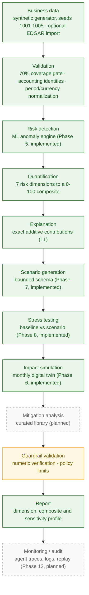
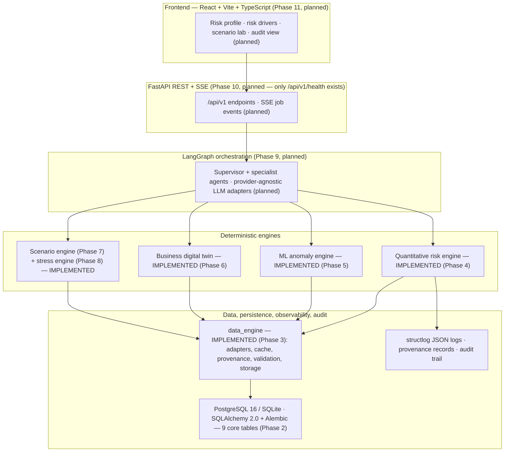

<div align="center">

# AI Business Risk

### Autonomous Multi-Agent Business Risk Intelligence &amp; Stress Testing Platform

**Detect → Quantify → Explain → Simulate → Propagate → Stress Test → Mitigate → Monitor → Audit**

[](#project-status)
[](#project-status)
[](#project-status)
[](LICENSE)


*A decision-support and research platform: an LLM-agent orchestration layer on top of deterministic, fully auditable quantitative engines.*

</div>

> **About the badges:** they are static and describe the locally verified Phase 6 state of this
> repository. **No CI service is configured yet** (Phase 12), so there is deliberately no build or
> coverage-service badge. `FastAPI` is marked *foundation only* because Phase 2 shipped the app factory
> and `/api/v1/health`; the rest of the API is Phase 10.

> ### LLMs do not calculate financial risk.
>
> LLMs handle **interpretation, reasoning, orchestration, natural-language scenario translation and
> explanation**. **Deterministic Python engines** perform the financial arithmetic, quantitative scoring,
> simulation, stress testing and numerical verification. Every number a user sees must be reproducible
> from engine output — never generated by a model.

---

## Project Status

| Phase | Status |
|---|---|
| Phase 0 — Research + Specification | ✅ Complete |
| Phase 1 — Architecture Freeze | ✅ Complete |
| Phase 2 — Foundation | ✅ Complete |
| Phase 3 — Data Engineering | ✅ Complete |
| Phase 4 — Quantitative Risk Engine | ✅ Complete |
| Stage 5 — Market/Macro Integration | ✅ Approved |
| Phase 5 — ML Engine | ✅ Complete |
| Phase 6 — Business Digital Twin | ✅ Complete |
| Phase 7 — Scenario Engine | ✅ Complete |
| Phase 8 — Stress Testing | ✅ Complete |
| Phase 9 — Multi-Agent LangGraph | ⏳ Planned |
| Phase 10 — Backend/API | ⏳ Planned |
| Phase 11 — Frontend | ⏳ Planned |
| Phase 12 — Testing/Observability/Security | ⏳ Planned |
| Phase 13 — Evaluation/Benchmarking | ⏳ Planned |
| Phase 14 — Final Documentation/Viva | ⏳ Planned |

**Where the project stands today.** The repository contains the frozen research/architecture documents
(Phases 0–1), the backend foundation (Phase 2), the complete data-engineering pipeline with a
deterministic synthetic generator (Phase 3), the complete quantitative risk engine with its approved
Stage 5 market/macro integration (Phase 4), the ML anomaly engine with SHAP driver attribution
(Phase 5), the deterministic business digital twin (Phase 6), the bounded scenario engine (Phase 7)
and the stress-testing engine — baseline-vs-stressed KPI deltas, breach policy, EBITDA waterfall and
one-factor-at-a-time sweeps (Phase 8). This is not yet an end-to-end platform: there is no agent
graph, application API or frontend in the repository, and none of the engines has a production entry
point — the twin, scenario and stress engines are invoked programmatically from tests and validation
notebooks.

Phases are executed strictly one at a time, and every phase ends with a report plus an explicit approval
gate. The Phase 8 closure report is
[docs/08_stress_testing/phase-report.md](docs/08_stress_testing/phase-report.md).

---

## System Architecture

### Conceptual workflow

Solid/green = implemented today. Amber = partially implemented (deterministic layer exists, presentation
layer planned). Dashed/grey = planned in a future phase.



### Architectural boundary



### Hard architectural rules (frozen)

| Rule | Statement |
|---|---|
| R1 | The LLM never performs arithmetic, risk calculation, simulation, database writes, or policy enforcement |
| R2 | Every LLM-emitted number is machine-verified against engine outputs before it reaches a user |
| R3 | Deterministic modules (`risk_engine`, `simulation`, `ml_engine`, `data_engine`, `guardrails`) never import LLM/agent code — enforced by a test |
| R4 | The system is fully functional offline through the synthetic data path |
| R5 | Third-party data is cached locally with source/license/timestamp and never redistributed |
| R6 | Same inputs + seed ⇒ identical deterministic outputs (reproducibility) |
| R7 | The LLM provider is swappable via adapters (GLM-5.3-Flash is only the development default) |

R3 is not a slogan: `backend/tests/unit/test_architecture_imports.py` fails the build if a deterministic
module imports agent/LLM code, and the Phase 4 engine imports no HTTP client, cache or database session.

---

## What Is Implemented Today

### Quantitative Risk Engine (`backend/risk_engine/`)

Pure-function, deterministic engine — no FastAPI, LangGraph, LLM or database imports.

- **Registry-driven metrics** — 40 formula definitions with anchors, edge cases and a single
  `registry_version` (`1.0.0`) stamped on every result.
- **Piecewise-linear scoring** over frozen anchor points, with **endpoint clamping** so a score can never
  leave 0–100, and frozen zero-denominator edge cases applied verbatim instead of interpolated.
- **Severity bands** — 0–25 Low · 25–50 Moderate · 50–75 High · 75–100 Critical.
- **Dimension aggregation** — mean of the available metric scores (equal metric weights, recorded).
- **Weighted composite scoring** with **configured vs effective weights** exposed side by side
  (effective weight is re-normalized over the dimensions that actually have data).
- **Exact additive contributions** — metric contributions sum to the dimension score and dimension
  contributions sum to the composite, reconciled to `abs_tol = 1e-9`. This is the L1 explanation layer.
- **Sensitivity analysis** — each dimension weight perturbed ±20% with re-normalization, reporting the
  composite range and Spearman rank stability.
- **Missing-input handling** — `MISSING_INPUT` / `INVALID_INPUT` / `UNAVAILABLE` / `INSUFFICIENT_HISTORY`
  with `value=None`, never defaulted to zero; an entirely missing profile yields a `None` composite
  instead of a fabricated mid-range score.
- **Altman handling** — Z / Z′ / Z″ variant auto-selection (public manufacturer, private, non-manufacturer),
  each variant keeping its own cut-offs and mapped to a 0–100 score.
- **Determinism** — identical inputs and seeds produce identical outputs (asserted in fixture, golden and
  property tests).

### Market Integration (Stage 5, D18–D21 — approved)

- **Separate equity and benchmark legs for beta** — the app/engine passes two distinct series
  (`calc_beta(equity, benchmark)`), so the earlier degenerate "one series against itself ⇒ β = 1.0" path
  is structurally impossible; with a single leg the metric reports `UNAVAILABLE`.
- **Daily log returns** `ln(P_t / P_{t−1})`, **inner-date alignment** across the two beta legs (no forward
  fill), joined observation count recorded.
- **Minimum-history validation** — beta 120 aligned observations, VaR/ES 60, volatility 30.
- **Equity / VaR / ES separation** — `var_95` and `es_95` consume the company equity leg only.
- **FX separation** — FX returns feed `fx_volatility` only and never reach equity metrics or VaR/ES.
- **Provenance** — each supplied leg contributes source, as-of date, observation count and checksum where
  available, stamped onto the routed metric result.

### Macro Integration (Stage 5, D20 — approved)

- **CPI 24-month path** → `inflation_passthrough` (requires 24 monthly observations).
- **Gross-margin change** over the same window, combined as a **signed** margin/inflation gap
  (`Δgross_margin − ΔCPI`), not an absolute difference.
- **FEDFUNDS** current value and **trailing 5-year median** → `rate_environment` (requires 60
  observations).
- **GDP volatility** pass-through to `gdp_sensitivity` remains optional and assumption-based.
- **Strict missing-history behavior** — short or absent macro series produce `MISSING_INPUT`, never a
  synthesized value.

### Verification

| Gate | Result (re-verified at Phase 8 closure) |
|---|---|
| Test suite | **498 passed** |
| `risk_engine` line coverage | **94%** (target ≥ 80%) |
| `ml_engine` line coverage | **99%** (503 statements) |
| `simulation` package coverage | **97–100%** (`stress.py` and `sensitivity.py` **97%** each) |
| Registry coverage | **40 / 40** formulas have a hand-computed fixture |
| Golden profiles (seeds 1001–1005) | **5 / 5** byte-identical baselines |
| ML golden (seed 7101) | **1 / 1** pinned fixture, `abs_tol = 1e-9` |
| Stress goldens (seeds 1001–1005) | **5 / 5** new `STRESS_VERSION`-gated files |
| Contribution reconciliation | **5 / 5** checks at `abs_tol = 1e-9` |
| Ruff (`backend`, `scripts`) | **clean** |
| Ruff format (`backend`, `scripts`) | **clean** (119 files) |
| Mypy (`backend`) | **clean** (115 source files) |
| Import cycles (Graphify graph) | **0** strongly-connected import components over 1,318 import edges |
| Notebooks | Phase 8 re-executed on a fresh kernel (17 cells, **0 error outputs**); Phases 3–7 unchanged and previously verified |

*Honest footnote on the ML engine:* on the pinned fixture the **rolling rule baseline beats the
Isolation Forest** (PR-AUC 0.8304 vs 0.5250), so the retention verdict is `baseline_wins_or_tie` and the
model is **not** retained — this is the intended falsifiability behaviour of decision D4, not a defect.
Those metrics are also **in-sample** on a single 24-period synthetic company, not generalization
estimates. Attribution uses `shap.Explainer`, which SHAP 0.52.0 resolves to `PermutationExplainer`
(TreeSHAP cannot satisfy the engine's additivity contract against `decision_function`); it is seeded
and its RNG state is restored so explanations are reproducible. See
[docs/05_ml_engine/phase-report.md](docs/05_ml_engine/phase-report.md).

*Honest footnote:* Ruff also lints notebook *cell* code by default. `ruff check .` reports findings
inside the notebooks (E402/I001/E501 caused by the `sys.path` bootstrap in their setup cells). That
is a recorded, accepted condition for these research notebooks — no `backend/` or `scripts/` file has a
Ruff finding. Likewise, Hypothesis is **not** used: the property tests use deterministic seeded
randomization (`random.Random(42)`).

---

## The Seven Risk Dimensions

Frozen terminology from [docs/01_architecture/risk-engine.md](docs/01_architecture/risk-engine.md):

| Dimension | What it captures | Implemented metrics (examples) |
|---|---|---|
| **Financial Strength** | Profitability, leverage and coverage | Gross / operating / net margin, ROA, ROE, debt-to-equity, debt-to-EBITDA, interest coverage, DSCR |
| **Liquidity** | Ability to meet short-term obligations | Current ratio, quick ratio, cash ratio, cash runway (months), short-term obligation coverage |
| **Market / External-Price Exposure** | Sensitivity to rates, FX, commodities and traded prices | Interest-rate sensitivity, FX exposure score, commodity exposure score, revenue volatility, equity volatility, beta, VaR 95%, ES 95% |
| **Credit** | Counterparty and default risk | Days sales outstanding, receivables concentration (HHI), receivable trend, Altman Z (Z / Z′ / Z″), Merton DD/PD (reference-only, listed mode) |
| **Operational** | Working-capital efficiency and supply resilience | DIO, DPO, cash conversion cycle, supplier concentration (HHI), opex rigidity, single-source flags |
| **Concentration** | Dependence on few customers, suppliers, products or regions | HHI, CR1, CR3 across the four buckets |
| **Macro** | Environment and pass-through | Inflation pass-through, interest-rate environment gap, macro FX volatility, GDP sensitivity |

## Quantitative Engine at a High Level

The registry-driven metrics fall into recognizable financial families — **liquidity, leverage,
profitability, working capital, market/external-price exposure, concentration, growth/trend and credit
strength** — and each one maps through frozen anchors to a 0–100 *risk* score (higher = riskier). The
engine then aggregates metric → dimension → composite, keeps the explanation exact (additive
contributions), and quantifies how much the composite depends on the chosen weights (±20% sensitivity).

This README deliberately does **not** restate the formulas: the registry is the single source of truth and
is versioned. Full definitions, anchors, edge cases and the documented interpretations live in
[docs/01_architecture/risk-engine.md](docs/01_architecture/risk-engine.md) (§1–§10 frozen method,
§11–§13 implemented state, Stage 5 routing and recorded interpretation notes). Any anchor change requires a
registry-version bump and a reviewed golden-baseline regeneration — a golden change without a version bump
is treated as a defect.

## Data Architecture

- **Synthetic-first, offline-capable (R4).** A deterministic generator produces companies from frozen seeds
  (1001–1005: manufacturing healthy/stressed, retail seasonal, services/SaaS stable, manufacturing
  concentrated with injected anomalies), across sectors, sizes, currencies (INR/USD/EUR), monthly or annual
  periods, with seasonality, growth drift, debt schedules, concentration buckets and labelled anomaly
  injection. The canonical path needs no network at all.
- **Phase 3 adapters** behind source-neutral typed contracts: SEC EDGAR (feature-flagged, off by default),
  FRED (macro), World Bank (macro), Stooq (market, primary) and optional Yahoo/yfinance (throttled
  fallback). Every adapter returns an explicit success / degraded / unavailable result — external failure
  never fabricates a value.
- **Market data** feeds the Stage 5 equity, benchmark and FX legs; **macro data** feeds CPI, FEDFUNDS and
  GDP-volatility scalars.
- **Provenance** on every fetch: source, endpoint, retrieval timestamp, requested non-secret parameters,
  license/terms tag, SHA-256 checksum where a payload exists, cache status and outcome.
- **Caching** is offline-first with checksums, TTL and atomic writes: a valid fresh cache entry is used
  first, an explicitly marked stale entry may be used when a live request fails, otherwise a typed
  unavailable result is returned.
- **Source attribution and licensing (R5):** all third-party data is license/terms-tagged, and downloaded
  payloads are never committed or redistributed — the repository ships only the synthetic fixtures.
- **Deterministic offline testing:** no test touches the network; adapter tests run against hand-written
  fixture payloads in `backend/tests/fixtures/`.

See [docs/01_architecture/data.md](docs/01_architecture/data.md) and
[docs/03_data-engineering/phase-report.md](docs/03_data-engineering/phase-report.md).

---

## Research & Engineering Focus

The project is organised around a small number of claims that are frozen in the Phase 0/1 specification:

- **Deterministic-grounded agents.** The LLM plans, orchestrates and narrates; it is structurally forbidden
  from performing arithmetic or simulation (R1), and every number it emits is machine-verified against
  deterministic engine output before reaching a user (R2). Measuring that "numeric faithfulness" is the
  project's central research question.
- **Quantitative risk reasoning on standard, cited reference models** — ratio families, Altman Z variants,
  Merton distance-to-default, historical VaR/Expected Shortfall — rather than invented formulas.
- **Stress propagation through a deterministic business digital twin** (monthly recursion, supply-capped
  revenue, FX/commodity pass-through, revolver draws with an explicit funding-gap breach).
- **Layered explainability:** exact additive contributions (L1) → dimension and metric attribution →
  weight sensitivity → narrative explanation that is validated against those engine numbers.
- **Guardrails:** the specification defines 13 guardrail rules plus control limits (tool calls, tokens,
  timeouts, retries) around LLM behaviour.
- **Auditability and reproducibility:** run traces, source provenance, a versioned formula registry, golden
  baselines, seeded determinism.
- **Benchmark evaluation plan** (Phase 13): rule-based ratios (B1), standalone ML (B2), a single LLM analyst
  (B3) and an unguarded multi-agent system (B4), compared against the proposed guarded system, with
  guardrail ablations.

**Status honesty:** the points above describe the *frozen research plan and architecture*, not finished
results. The evaluation phase that produces measured comparisons is Phase 13; nothing in this repository
should be read as published research or a benchmark claim.

### Recorded specification interpretations (approved at Phase 4 closure)

These are explicitly **recorded** rather than silently resolved; changing any of them is a new,
separately approved work item:

- **Q-M1 — volatility observation floor:** the implementation uses a **30-observation** floor for equity and
  FX volatility; the longer-history expectation elsewhere in the specification remains an open
  documentation reconciliation item.
- **Q-M2 — VaR / ES interpretation:** both `var_95` and `es_95` use the **company/equity** return leg, FX
  returns are isolated to FX volatility, and benchmark returns are used for **beta only**.
- **Q-C1 — inflation pass-through sign:** the margin/inflation gap is **signed**, `Δgross_margin − ΔCPI`.

## Project Structure

```text
AI-Business-Risk/
├── backend/
│   ├── app/                  # FastAPI app factory + /api/v1/health   (Phase 2)
│   ├── core/                 # frozen settings contract + error envelope
│   ├── database/             # SQLAlchemy 2.0 models, session, Alembic migrations
│   ├── data_engine/          # Phase 3 contracts, synthetic generator, validation,
│   │                         #   normalization, EDGAR/FRED/World Bank/Stooq/Yahoo
│   │                         #   adapters, cache, provenance, storage, features
│   │                         # + Stage 5 market_inputs / macro_inputs / risk_inputs
│   ├── risk_engine/          # Phase 4 contracts, registry, metrics/, scoring,
│   │                         #   sensitivity, engine
│   ├── ml_engine/            # Phase 5 features, Isolation Forest, SHAP, eval
│   ├── simulation/           # Phase 6 twin · Phase 7 scenarios · Phase 8 stress/sensitivity
│   └── tests/                # unit · integration · property · golden · fixtures
├── docs/
│   ├── 00_research/          # source-verified research (Phase 0)
│   ├── 01_architecture/      # frozen architecture contracts (Phase 1)
│   ├── 02_foundation/        # Phase 2 report
│   ├── 03_data-engineering/  # Phase 3 report
│   ├── 04_quantitative-risk/ # Phase 4 + Stage 5 report
│   ├── 05_ml_engine/         # Phase 5 report
│   ├── 06_digital_twin/      # Phase 6 report
│   ├── 07_scenario_engine/   # Phase 7 report
│   ├── 08_stress_testing/    # Phase 8 report
│   ├── development-log.md
│   └── master-project-specification.md
├── notebooks/
│   ├── 03_data_engineering/  # synthetic data profiling
│   ├── 04_quantitative_risk/ # formula validation · Stage 5 market-inputs validation
│   ├── 05_ml_engine/         # ML validation
│   ├── 06_digital_twin/      # twin validation
│   ├── 07_scenario_engine/   # scenario validation
│   └── 08_stress_testing/    # stress validation
├── scripts/                  # generate_company.py · seed_db.py
├── README.md
├── pyproject.toml
├── requirements-lock.txt
├── alembic.ini
├── docker-compose.yml
├── Dockerfile
├── .env.example
├── .gitignore
└── LICENSE
```

---

## Roadmap

### Completed

- [x] Phase 0 — Research + Master Specification
- [x] Phase 1 — Architecture Freeze
- [x] Phase 2 — Foundation
- [x] Phase 3 — Data Engineering
- [x] Phase 4 — Quantitative Risk Engine
- [x] Stage 5 — Market/Macro Integration (D18–D21, approved)
- [x] Phase 5 — ML Engine (Isolation Forest anomaly detection + SHAP attribution, benchmarked against a rule baseline)
- [x] Phase 6 — Business Digital Twin
- [x] Phase 7 — Scenario Engine (bounded schema, presets, clamp/validate)
- [x] Phase 8 — Stress Testing (KPI deltas, breach policy, EBITDA waterfall, OFAT sweeps)

### Planned

- [ ] Phase 9 — Multi-Agent LangGraph (supervisor + specialist agents, transcript tests, numeric verification)
- [ ] Phase 10 — Backend/API (REST + SSE job lifecycle, weights persistence)
- [ ] Phase 11 — Frontend (React + Vite + TypeScript dashboard)
- [ ] Phase 12 — Testing / Observability / Security
- [ ] Phase 13 — Evaluation / Benchmarking (B1–B4 baselines, guardrail ablations)
- [ ] Phase 14 — Final Documentation / Viva

**Roadmap stack (none of this is implemented yet — listed only to be explicit about intent):** LangGraph
(Phase 9); React + Vite + TypeScript with ECharts/Recharts, GSAP/ScrollTrigger, Motion and TanStack Query
(Phase 11); the full REST/SSE API surface (Phase 10); JWT auth, roles,
rate limiting and hardening (Phase 12). The only FastAPI surface today is `/api/v1/health`, and the only
persistence today is the Phase 2 core schema managed with Alembic. Isolation Forest + SHAP (Phase 5), the
digital twin (Phase 6), the scenario engine (Phase 7) and the stress engine (Phase 8) **are** implemented
but are not yet exposed through any service, API or agent.

## Quick Start

Requires **Python 3.11+** (developed on 3.12) and Git.

```bash
git clone https://github.com/SuryanshSharma500123597/Ai-Business-Risk.git
cd Ai-Business-Risk
```

Create a virtual environment and install the project with the dev tooling:

```bash
python -m venv .venv

# Windows (PowerShell)
.venv\Scripts\Activate.ps1
# macOS / Linux
source .venv/bin/activate

pip install -e ".[dev]"
```

Optional extras (notebook tooling, market fallback adapter):

```bash
pip install -e ".[notebook,market]"
```

Configure the environment — `.env.example` contains **variable names only, never values**:

```bash
# Windows
copy .env.example .env
# macOS / Linux
cp .env.example .env
```

> **Never commit `.env`.** It is ignored by `.gitignore` (together with `.env.*`, while `.env.example`
> stays tracked). Secrets are supplied only through the environment, never through code or documentation.

Run the verification suite used for the Phase 4 gate:

```bash
python -m pytest -q
python -m pytest -q --cov=backend.risk_engine --cov-report=term
python -m ruff check backend scripts
python -m ruff format --check backend scripts
python -m mypy backend
```

Use the repository CLIs to generate a synthetic company or seed the database:

```bash
python scripts/generate_company.py --help
python scripts/seed_db.py --help
```

No network access is required: the synthetic generator is the primary data path, and the test suite never
touches an external endpoint.

## Documentation Map

| Document | Contents |
|---|---|
| [docs/00_research/phase-0-research.md](docs/00_research/phase-0-research.md) | Source-verified research: ERM practice, platforms, literature, data sources & licensing, LLM providers |
| [docs/master-project-specification.md](docs/master-project-specification.md) | Master project specification (problem, architecture, agents, engines, roadmap, evaluation) |
| [docs/01_architecture/project-overview.md](docs/01_architecture/project-overview.md) | Stable overview, hard rules R1–R7, document map |
| [docs/01_architecture/architecture.md](docs/01_architecture/architecture.md) | System architecture, layers, run lifecycle, environment contract |
| [docs/01_architecture/agents.md](docs/01_architecture/agents.md) | Agent state schema, graph topology, tools, permissions, guardrail wiring |
| [docs/01_architecture/data.md](docs/01_architecture/data.md) | Canonical schema, source contracts, validation rules, synthetic generator spec |
| [docs/01_architecture/risk-engine.md](docs/01_architecture/risk-engine.md) | Formula registry, scoring model, Stage 5 routing, implementation status |
| [docs/01_architecture/simulation.md](docs/01_architecture/simulation.md) | Digital twin, scenario schema & presets, stress methodology |
| [docs/01_architecture/api.md](docs/01_architecture/api.md) | REST/SSE API specification |
| [docs/01_architecture/database.md](docs/01_architecture/database.md) | Database schema |
| [docs/01_architecture/requirements.md](docs/01_architecture/requirements.md) | Functional and non-functional requirements |
| [docs/01_architecture/testing.md](docs/01_architecture/testing.md) | Test strategy, fixtures, golden policy, implementation status |
| [docs/development-log.md](docs/development-log.md) | Phase-by-phase development log |
| [docs/02_foundation/phase-report.md](docs/02_foundation/phase-report.md) | Phase 2 completion report |
| [docs/03_data-engineering/phase-report.md](docs/03_data-engineering/phase-report.md) | Phase 3 completion report |
| [docs/04_quantitative-risk/phase-report.md](docs/04_quantitative-risk/phase-report.md) | Phase 4 + Stage 5 completion report |
| [docs/05_ml_engine/phase-report.md](docs/05_ml_engine/phase-report.md) | Phase 5 completion report (ML anomaly engine) |

## Limitations

- This is a **B.Tech engineering/research project** and a **decision-support platform**, not a finished
  commercial product.
- It is **not professional financial advice**, **not a regulatory-certified risk system**, **not a live
  trading or treasury system**, and **not a replacement for professional risk teams**.
- Only Phases 0–5 exist. There is no digital twin, scenario engine, stress-testing engine, agent
  graph, application API or frontend yet, so no end-to-end user workflow is available. The Phase 5 ML
  engine is complete but is **not** wired into any service, API or agent, and has **no production entry
  point** — it is invoked programmatically from tests and its validation notebook.
- **The ML engine does not currently beat its own baseline.** On the pinned synthetic fixture the
  rolling z-score/IQR rule baseline achieves a higher PR-AUC (0.8304) than the Isolation Forest
  (0.5250), so the retention verdict is `baseline_wins_or_tie` and the model is not retained. This is
  the intended falsifiability behaviour, not a hidden failure — and it is **not** evidence of
  real-world anomaly-detection accuracy.
- **ML metrics are in-sample.** There is no train/test split: the model is fitted and scored on the
  same 24 periods of one synthetic company, so the reported figures are descriptive statistics of that
  fixture, not generalization estimates. Anomaly scores are also **batch-dependent** (a rank-CDF over
  training rows pooled with the scored rows).
- **Anomaly ≠ risk and attribution ≠ causation.** The ML engine produces no mapping onto the Phase 4
  0–100 risk score, and its SHAP drivers explain the model rather than the business cause.
- The ML engine has been validated **only** against synthetic injected anomalies. No real audited
  financial statements, no external benchmark, no predictive-validity claim.
- The engine is deterministic and unit-verified, but it has **not** been validated against real audited
  financial statements or an external risk benchmark; market and macro metrics depend on caller-supplied
  cached series and degrade explicitly when those are absent.
- Merton distance-to-default remains reference-only and disabled by default (asset value and its volatility
  are unobservable in the synthetic path).
- Docker and live PostgreSQL were not verified locally during Phase 2; the test suite runs on SQLite in
  memory.
- The recorded interpretation notes (Q-M1, Q-M2, Q-C1) are open specification-reconciliation items that
  require explicit approval before any change.

## License

Released under the **MIT License** — see [LICENSE](LICENSE).


